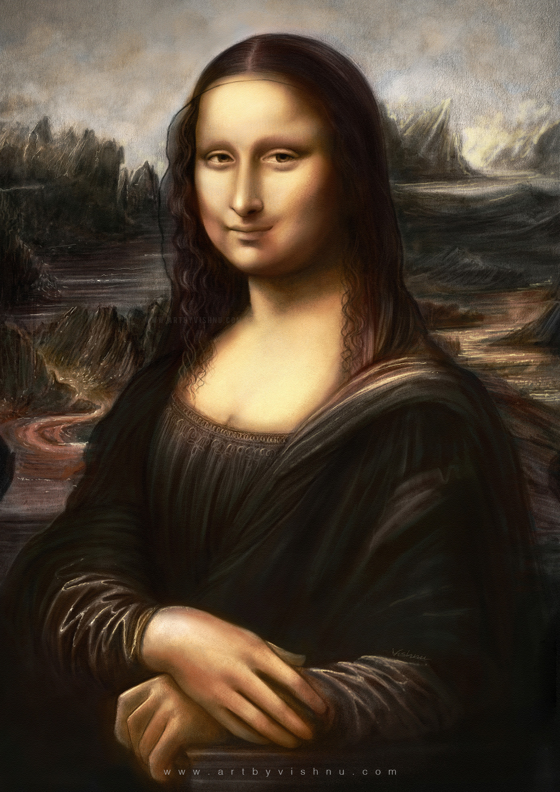

# Mono Lisa AR

> Здесь с помощью дополненой реальности (AR) ты увидишь новый взгляд на извесную на весь мир картину Леонарда Да Винчи "Мона Лиза"

Новое представление было сгенерировано нейросетью с помощью сервиса([Phygital+](https://app.phygital.plus/))

Наведя камеру на картину тебе откоется новое представление картины, которое ты ещё не видел.

Скачать для тестирование приложение можно [тут](https://drive.google.com/drive/folders/1LCmlwglaGA3UjPuN1zsXA0FcQBN1IW2J?usp=sharing )