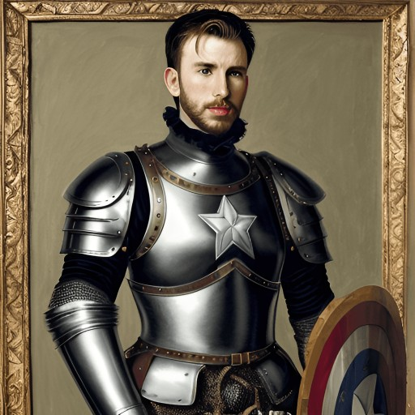
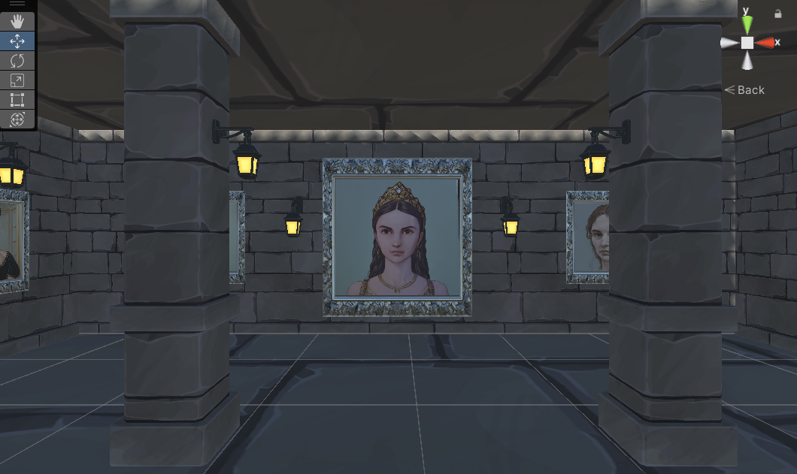
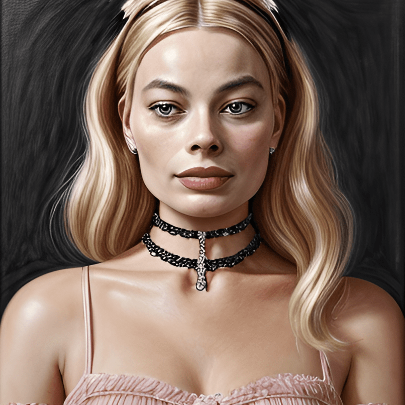
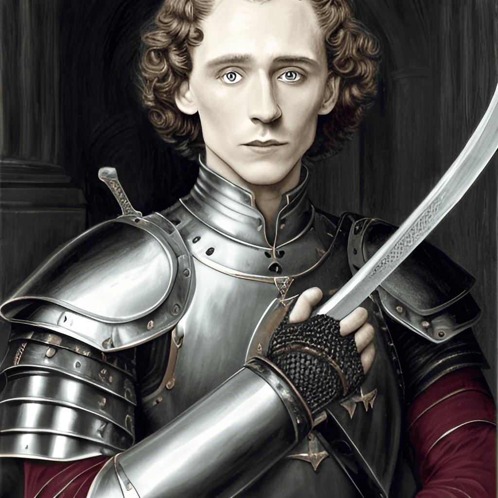
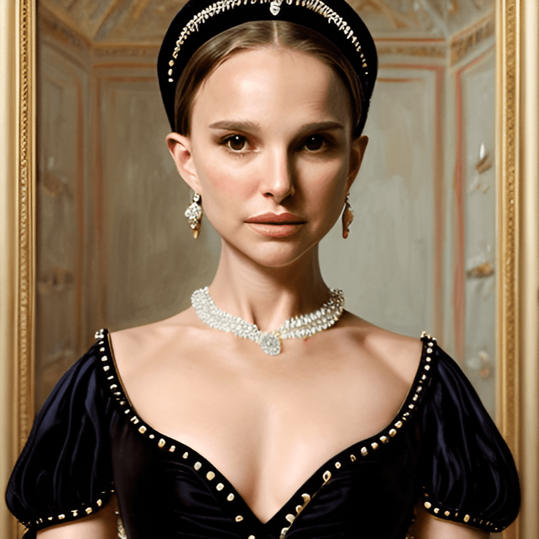
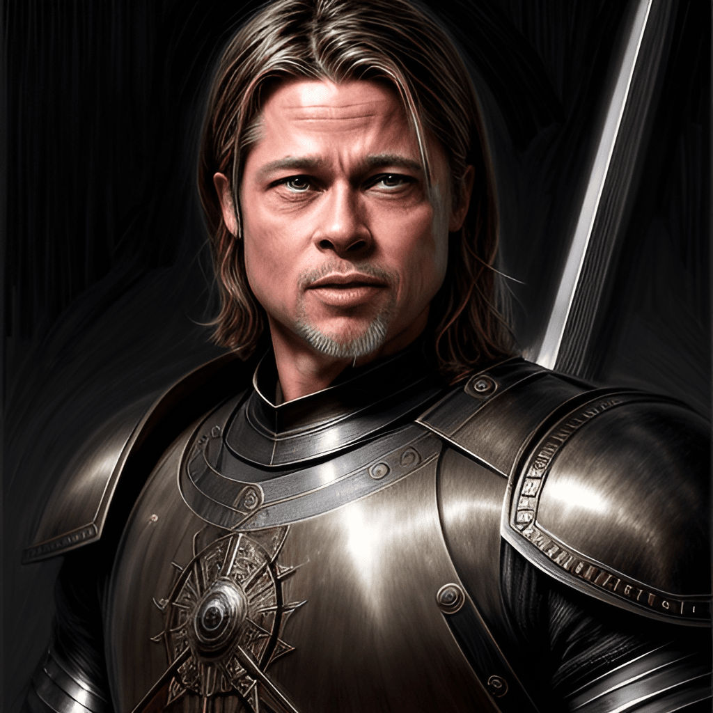
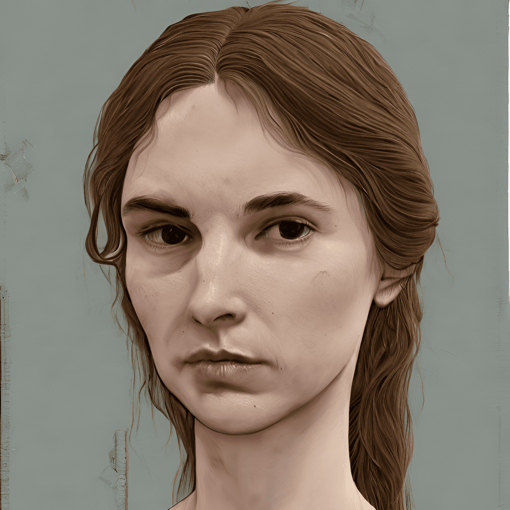
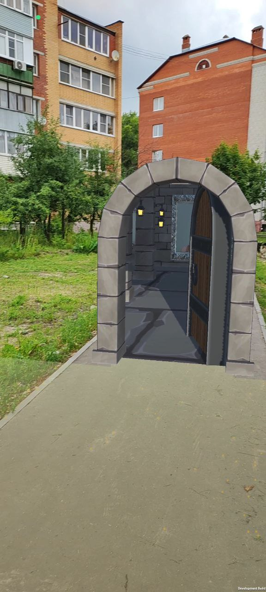
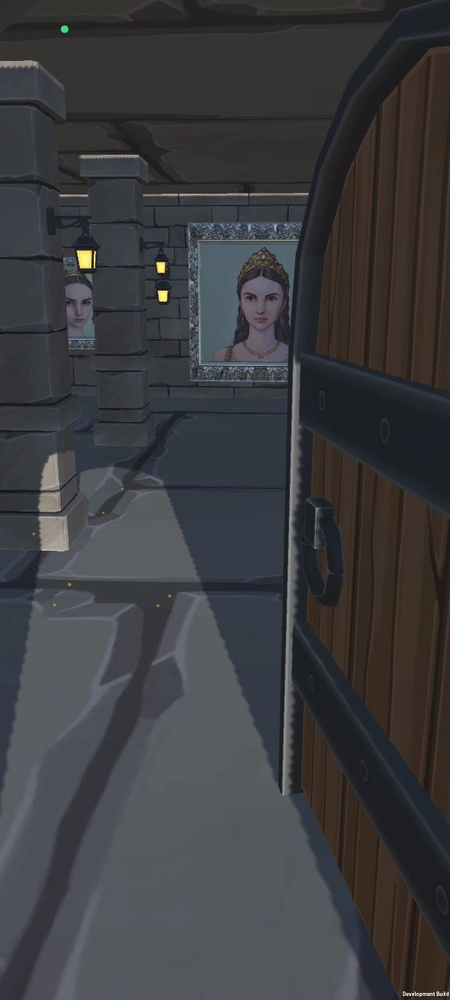
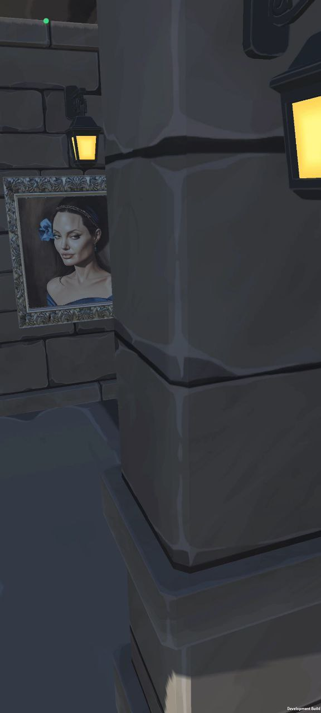

#  Gallery AR 

## Добро пожаловать в галерею нового поколения!

> Здесь с помощью дополненой реальности (AR) ты познакомишься с экспонатами сгенерироваными нейросетью с помощью сервиса([Phygital+](https://app.phygital.plus/))
за основу были взяты портреты периода средневиковья и голивудские звезды нашего времени.

___

*это только часть экспонатов**
> На стене напротив входа тебя встретят портрет создательницы приложения(то есть меня хехе) тоже сгенерированы нейросетью

___
# **ИИ всему голова!**

## *Как пользоваться приложением?*

0. Если ваш телефон андроид с поддержкой ARCore (проверить можно [тут](https://developers.google.com/ar/devices?hl=ru#emulators)  или в настройках телефона
Настройки -> Все приложения -> вводим *"Cервисы Google Play для AR"* если есть,то все ОК )

1. Cкачиваем  [apk](https://drive.google.com/drive/folders/1pZ0HyHqf4dYRM5KDN4vgOHLrD8IeXSOt?usp=sharing )

2. Устанавливаем на телефон (если спрашивают установка с неизвестного источника разрешайте, вирусов нет)

3. Запускаем, заставка Unity и подсказака к использованию

4. Медленно сканируем горизонтальную поверхность, появляются желтые многоугольники в этом периметре и тапаем на экран. Появляется дверь. Заходи внутырь, не бойся!

***

> *Рекомендация!*
  Запускать удобнее на улице или на большом пространстве приблизительно 5 на 5 метра (числа взяла на глаз)

